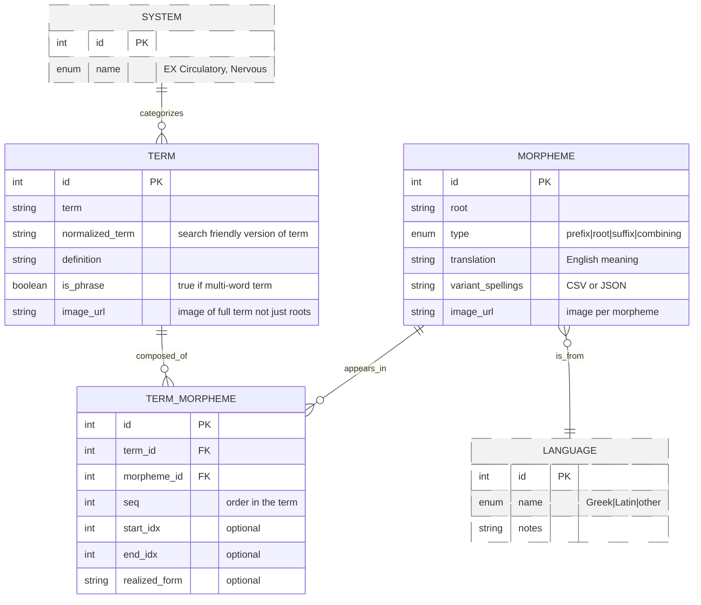

```mermaid
erDiagram
  %% Core Tables to begin with
  MORPHEME {
    int id PK
    string root
    enum type "prefix|root|suffix|combining"
    string translation "English meaning"
    string variant_spellings "CSV or JSON"
    string image_url "image per morpheme"
  }

  TERM {
    int id PK
    string term
    string normalized_term "search friendly version of term"
    string definition
    boolean is_phrase "true if multi-word term"
    string image_url "image of full term not just roots"
  }

  TERM_MORPHEME {
    int id PK
    int term_id FK
    int morpheme_id FK
    int seq "order in the term"
    int start_idx "optional"
    int end_idx   "optional"
    string realized_form "optional"
  }

  %% Not neccesary tables but they could prove to be useful for educational purposes
  LANGUAGE:::secondary {
    int id PK
    enum name "Greek|Latin|other"
    string notes
  }

  SYSTEM:::secondary {
    int id PK
    enum name "EX Circulatory, Nervous"
  }

  %% Table Relationships
  TERM ||--o{ TERM_MORPHEME : "composed_of"
  MORPHEME ||--o{ TERM_MORPHEME : "appears_in"
  MORPHEME }o--|| LANGUAGE : "is_from"
  SYSTEM ||--o{ TERM : "categorizes"

  %% Any grey table will be those aformentioned seoncdary tables
  classDef secondary fill:#f2f2f2,stroke:#888,stroke-dasharray: 3 3;
```
